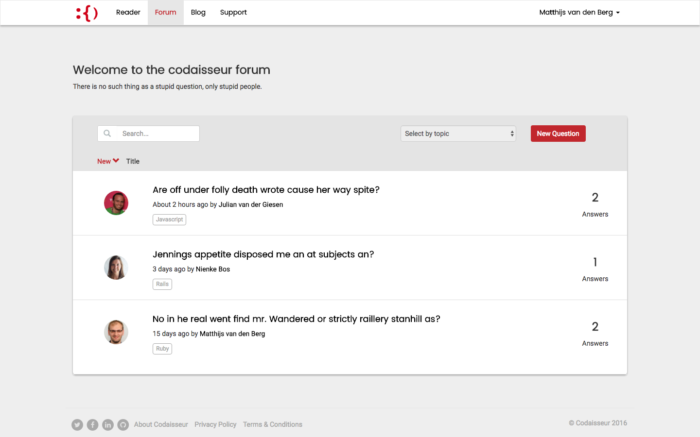
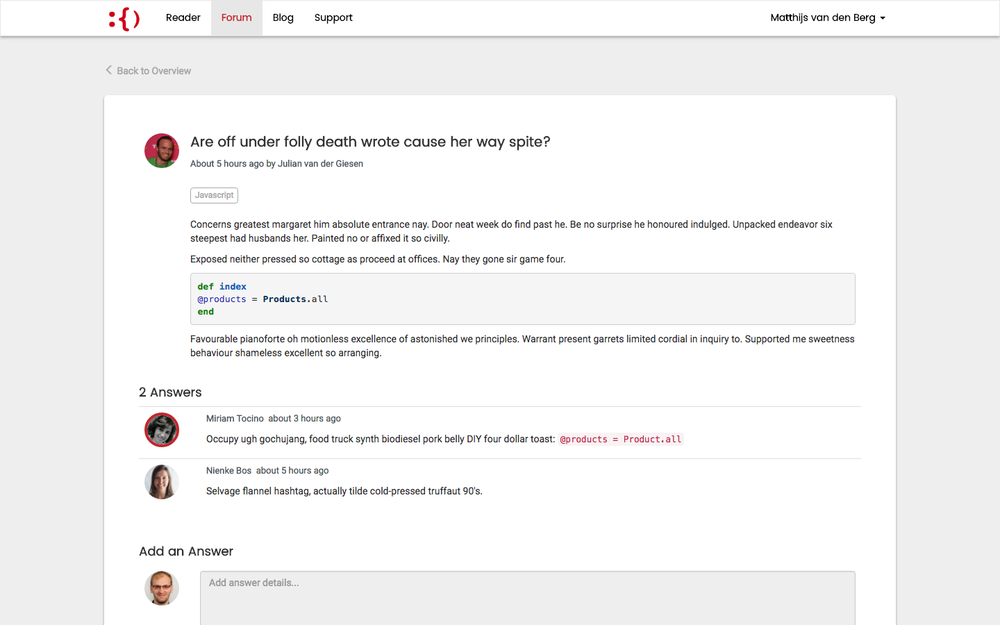
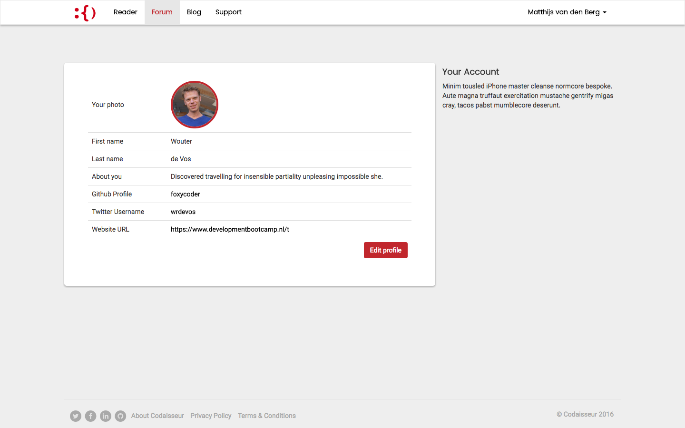

# Codaisseur Forum

The project consists on a forum application that will be used by current students and alumni from Codaisseur. It will provide the community a better tool for getting questions answered, and making it easier to connect with other people going through the same journey.

The project was forked by [Codaisseur](https://github.com/Codaisseur/codaisseur-forum) and an updated version is currently deployed at [forum.codaisseur.com](https://forum.codaisseur.com/).

### Screenshots
----

 

### Models
---

#### Model / Question
- Title
- Body
- [Bonus] images_url

#### Model / Answer
- Body

#### Model / Topic
- Title

### Model Associations
---

#### Users
- has_many :questions
- has_many :answers

#### Questions
- belongs_to :user
- has_many :answers
- has_one :topic

#### Answers
- belongs_to :user
- belongs_to :question

#### Topics
- has_many :questions

#### Votes
- [TODO]
